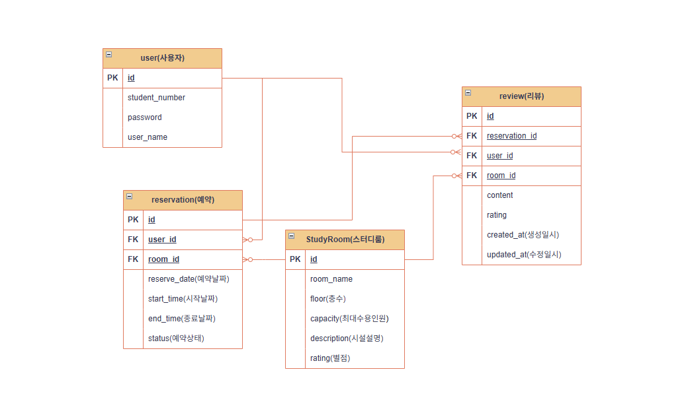

# 🏫 스터디룸 예약 시스템 (Study-Room-Reservation)

> **청년취업사관학교 도봉캠퍼스 AI 서비스 개발자 과정**
> 실무 관점의 데이터 설계와 검증 로직 구현을 위한 미니 프로젝트입니다.

---

## 1.  프로젝트 구조 (Repository Structure)

* **study-room-reservation/** (최상위 루트)
    * `.gitignore` / `README.md` / `uv.lock`
    * **app/**
        * **models/** : [DB 설계도] SQLAlchemy 2.0 Mapped 기반 테이블 정의
        * **schemas/** : [데이터 규격] Pydantic 모델 (Request/Response)
        * **services/** : [핵심 로직] 비즈니스 규칙 및 검증
        * **repositories/** : [창고 관리] DB CRUD 직접 수행
        * **routers/** : [안내 데스크] API 엔드포인트
        * `database.py`: PostgreSQL 연결 및 세션 관리
        * `main.py`: 애플리케이션 진입점

---

## 2.  기획 의도 (Why)

### 2.1 개발 배경
* 학생들이 스터디룸을 예약할 때 발생하는 **중복 예약 문제**와 **무분별한 독점**을 막기 위해 체계적인 예약 시스템이 필요했습니다.

### 2.2 해결하고자 하는 문제
* **중복 예약 방지**: 동일 시간대, 동일 강의실에 대한 중복 예약을 원천 차단합니다.
* **공정한 이용**: 하루 최대 이용 시간을 제한하여 특정 사용자의 독점을 방지합니다.
* **데이터 무결성**: 과거 날짜 예약 금지, 운영 시간 외 예약 금지 등 실무적인 검증 로직을 구현합니다.

---

## 3.  설계 및 구조 (Architecture)

### 3.1 Layered Architecture
* **Router → Service → Repository → Model**로 이어지는 4계층 구조를 채택했습니다.
* **이유**: API 경로(Router)와 실제 비즈니스 규칙(Service)을 분리하여 코드의 유지보수성을 높이고, 테스트가 용이한 구조를 지향했습니다.

### 3.2 DB 모델링 전략 (ERD 핵심 포인트)
* **역정규화(Denormalization) 채택**: `Review` 테이블에 `user_id`와 `room_id`를 중복 포함시켜 조회 성능을 최적화했습니다.
* **실무 표준 명명 규칙**: 모든 필드에 **Snake Case**를 적용하고, PK 필드는 `테이블명_id` 형식을 사용하여 가독성을 확보했습니다.

---

## 4. 성장 포인트 (Retrospective)

### **[Troubleshooting: 논리 삭제(Soft Delete)와 데이터 보존]**
* **문제**: 회원 탈퇴 시 `db.delete()`를 사용하면 해당 유저의 과거 예약 기록과 통계 데이터가 함께 사라지는 문제 인지.
* **해결**: `User` 모델에 `is_active` 필드를 추가하고, 삭제 요청 시 상태값만 `False`로 변경하는 **Soft Delete** 방식을 채택함.
* **배운 점**: 실무 데이터베이스 운영 시 삭제보다 '상태 관리'가 데이터 히스토리 보존 측면에서 얼마나 중요한지 이해함.

### **[Troubleshooting: 데이터 타입 불일치와 직렬화 에러]**
* **문제**: Pydantic의 `datetime` 객체가 DB의 `Date`, `Time` 필드와 호환되지 않아 `ResponseValidationError` 발생.
* **해결**: Service 계층에서 `.date()`와 `.time()` 메서드로 데이터를 분리 추출하여 DB에 저장하는 로직을 구현함으로써 해결함.

---

## 5.  업데이트 기록 (Changelog)

### **v1.20: 비즈니스 로직 구현을 위한 계층별 역할 분담 완료 (2026-02-23)**
* **구조적 무결성**: Schema(데이터 정합성), Router(인터페이스 명세), Service(비즈니스 정책)의 3단계 수정을 통해 실제 서비스 운영이 가능한 견고한 예약 시스템 구축.
* **관심사 분리(SoC)**: 정책 검증 로직을 서비스 계층에 집중시켜, 라우터와 레포지토리는 본연의 역할에만 충실하도록 설계하여 유지보수성 및 테스트 용이성 확보.
* **실무형 비즈니스 정책 반영**: 
    * **타임머신 예약 방지**: 과거 날짜에 대한 예약 요청을 차단하는 로직 구현.
    * **공정 이용 규칙**: 유저별 하루 최대 이용 시간(120분) 제한 로직을 `datetime` 연산으로 정밀하게 구현하여 리소스 독점 방지.
* **데이터 입구 컷(Schema Validation)**: Pydantic의 `model_validator`를 활용하여 종료 시간이 시작 시간보다 빠른 논리적 오류를 데이터 수신 단계에서 즉시 차단.

### **v1.9: 예약 시스템 데이터 규격 고도화 (2026-02-22) [cite: 2026-02-22]
* **날짜/시간 분리 설계: reserve_date(date), start_time(time), end_time(time)으로 필드를 세분화하여 일별 예약 현황 조회 쿼리 최적화. [cite: 2026-01-29]

입력 값 검증: Pydantic Field의 ge=1 옵션을 사용하여 이용 인원(user_count)에 대한 비즈니스 제약 조건 반영. [cite: 2026-01-28]

v1.8: 인증 서비스(AuthService) 안정화 및 보안 강화 (2026-02-22) [cite: 2026-02-22]
환경 변수 로드 최적화: load_dotenv() 위치를 조정하고 클래스 생성자(__init__)에서 보안 자산을 로드하여 시스템 안정성 확보. [cite: 2026-01-29]

에러 가시성 확보: 로그인 로직 내 try-except 블록 보강 및 터미널 로그 출력을 통해 디버깅 효율성 증대. [cite: 2026-01-14]
### **v1.9: 예약 시스템 데이터 규격 고도화 및 유효성 검사 (2026-02-22)**
* **날짜/시간 분리 설계**: `reserve_date(date)`, `start_time(time)`, `end_time(time)`으로 필드를 세분화하여 특정 날짜의 예약 현황 조회 및 시간대별 중복 체크 쿼리 효율성 극대화.
* **입력 데이터 검증(Validation)**: Pydantic `Field`와 `ge=1` 제약 조건을 활용하여 이용 인원(`user_count`) 등 필수 입력값에 대한 실무형 유효성 검사 로직 적용.
* **API 명세 구체화**: 프론트엔드와 포스트맨 테스트를 고려하여 ISO 표준 날짜 및 시간 형식을 적용한 JSON 데이터 규격 정의.

### **v1.8: 인증 서비스(AuthService) 안정화 및 의존성 해결 (2026-02-22)**
* **의존성 트러블슈팅**: JWT 구현 중 발생한 `ModuleNotFoundError (jose)` 에러를 `python-jose[cryptography]` 설치를 통해 해결하고, 라이브러리 의존성 관리 능력 확보.
* **인증 로직 캡슐화**: `AuthService` 클래스 내에 토큰 생성, 비밀번호 검증, 환경 변수 로드 로직을 응집도 있게 배치하여 유지보수성 향상.
* **보안 자산 로드 최적화**: `load_dotenv()`를 활용해 `.env`에 저장된 `JWT_SECRET_KEY`를 안전하게 불러오는 환경 구성 완료.

### **v1.7: 유저 도메인 심화 및 운영 정책 반영 (2026-02-21)**
* **패널티 시스템 도입**: 노쇼 방지를 위한 `penalty_count` 필드 추가 및 3회 누적 시 자동 계정 정지 로직 구현.
* **권한 기반 설계(RBAC)**: `user_role` 필드(admin/user)를 추가하여 관리자 전용 기능 확장을 위한 기반 마련.
* **API 스키마 확장**: `UserResponse` 규격에 권한 및 패널티 정보를 포함하여 프론트엔드 대응력 강화.

### **v1.6: 보안 기반 다지기 (2026-02-20)**
* **인증 인프라**: `bcrypt` 해싱과 JWT 기반 인증 방식을 적용하여 보안 강화.
* **환경 변수 관리**: JWT 비밀 키 등을 `.env`로 관리하여 보안 자산화 수행.

### **v1.5: 전체 시스템 비동기 전환 (2026-02-20)**
* **Async/Await 체득**: 모든 서비스와 레포지토리 로직을 비동기로 전환하고, `run_sync` 등 비동기 환경에서의 특수 상황 처리 능력을 확보함.

### **v1.4: API 통합 및 구조화 (2026-02-20)**
* **임포트 지옥 해결**: `__init__.py`와 `__all__`을 활용하여 수많은 모델 클래스를 체계적으로 관리하는 **헤드셋 구조화** 설계 적용.

### **v1.3: 스터디룸 상세 설계 고도화 (2026-02-20)**
* **필드 확장**: ERD 기반으로 `room` 테이블에 상세 설명(`description`) 필드를 추가하고, 실제 비즈니스에 필요한 데이터 규격을 완성함.

### **v1.2: 관리자 관점의 필드 확장 (2026-02-20)**
* **운영 상태 관리**: 스터디룸에 `is_active` 필드와 `created_at` 타임스탬프를 적용하여 '데이터 추적'과 '운용 상태'를 고려한 관리자 관점의 설계를 경험함.

### **v1.1: DB 모형 및 관계 최적화 (2026-02-19)**
* **모델링 구축**: 핵심 4개 모델(User, Room, Reservation, Review) 구축 및 PostgreSQL 환경 설정 완료.
* **트레이드오프 결정**: 정규화와 조회 성능 간의 균형을 위해 리뷰 테이블의 역정규화 의사결정 수행.

### **v1.0: 프로젝트 초기화 (2026-02-19)**
* 프로젝트 아키텍처 설계 및 기본 개발 환경 세팅 완료.